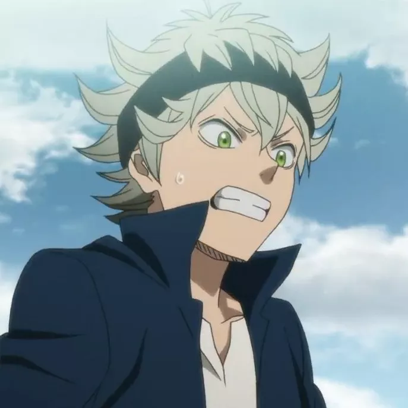
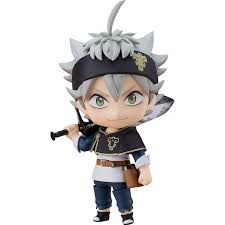
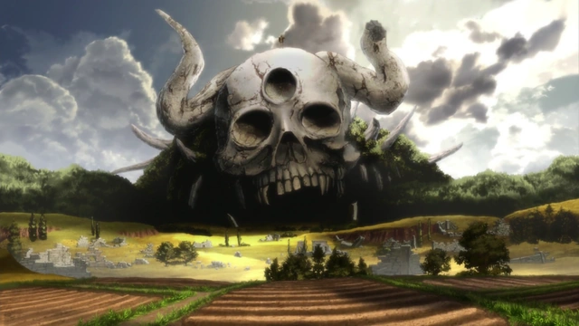
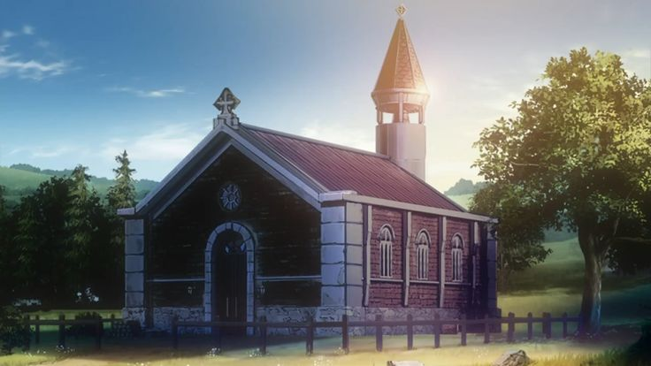
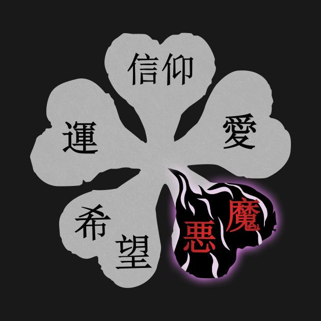

# Black Clover Game
Vamos a realizar el diseño sobre una serie animada japonesa muy entretenida y completa que nos pueede
ofrecer un amplio campo de desarrollo en un videojuego de plataformas, en el que se 
descubre la historia del personaje, de manera interactiva.

## Proyecto Arte 2D
### Temática de videojuego
La temática del videojuego es un juego medieval en el que nos encontramos en un gran reino en el que la 
gente adquiere poderes a través de sus grimorios de magia cuando crecen, una temática medieval pero con
el toque retro de un pixel art para no hacer los personajes del anime como tal.

Esta será un juego de plataformas en el que el personaje irá pasando fases, con diferentes movimientos
de la camara para alternar la historia y las escenas en la que se enfrentara a los enemigos, con la 
temática de pixel art.

### Concpeto de Videojuego
El protagonista es Asta, un chico que es adopta por un cura de una iglesia al encontrárselo junto a su hermano
Yuno en la puerta de la iglesia, crecen juntos en la parte pobre de la aldea y entrenan para convertirse los 
dos en rey mago que es el mago con mayor poder del renio y que dirige los diferentes grupos de caballeros,
pero resulta que hasta no tiene nada de poder mágico, entonces trabaja muy duro para mejorar su físico, y en 
la entrega de los grimorios resulta que recibe uno a pesar de no tener poder, pero este grimorio es especial,
ya que de normal son de 3 o 4 hojas que, el de cuatro representa poder y riqueza, pero el recibe un de 5, que 
es donde habitan los demonios, de los grimorios salen las habilidades y poderes que se desarrollan a lo largo
del videojuego peor al en vez de salir hechizos le sale una espada vieja y fea...

La aldea en la que vive asta, representa el fondo de la imagen inicial.

Y la idea es que en la plataforma aparezca el y ahi empezaría lo que es a contarse la historia inicial, una
vez se cuenta la historia inical pues que el personaje empiece a moverse a la aldea donde le dan su grimorio.

Su objetivo como comente es luchar contra el mal y convertirse en rey mago entrando en una asociación de 
caballeros, mejorando y nunca rindiéndose.

El protagonista será un chaval que recibe el grimorio en la historia y el cual tiene poderes demoniacos de 
antimagía y que está conectado él, llevando un demonio oculto dentro.

La idea es que sea un juego de tipo plataformas que tenga diferentes escenarios según avanza la historia, 
en el que también se encontraron más personajes con los que se comunica como si fuera el anime real, 
el personaje tendrá que enfrentarse a diversos retos y enemigos.

### Diseño Gráfico
- Vamos a crear al personaje original del juego de manera pixel art
- Crearemos al menos una plataforma la inicial en la que empieza la historia del videojuego.
- Y el título será el trébol de 5 hojas que representa al anime y al personaje protagonista.

Hablaremos sobre como hemos desarrollado el personaje poco a poco, con la herramienta utilizada.

### Tráiler del videojuego
La idea será hacer una introductoria del anime convirtiendo a Asta en el personaje Pixel Art que hayamos
diseñado, mostrando algunas escenas de la plataforma diseñada y con el logo integrado, por lo tanto, con 
algún opening de la seria con sus respectivos derechos de autor todos.

Hablaremos del formato utilizado y como hemos desarrollado el trailer.

### Informe sobre herramientas utilizadas
Hablaremos sobre los diferentes tipos de licencias.

Aquí pondremos un informe sobre las herramientas y formatos que hayamos utilizado para el desarrollo de 
los elementos.
